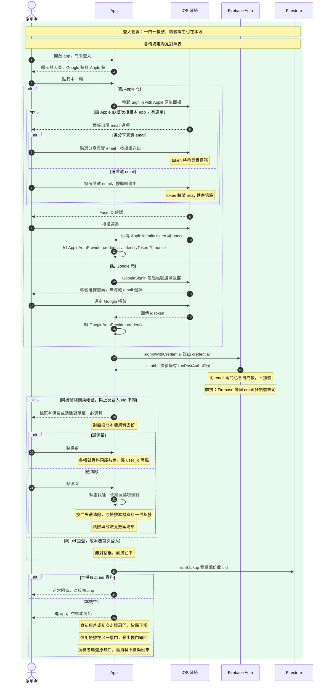

# 註冊登入重設計工作筆記 V1

## 定位與背景

- **來源:**
    - App Store 審核拒件，審核員無法登入
    - Google 對陌生裝置與地區必出安全挑戰
    - 關閉兩步驟驗證無法解除該挑戰
- **決策方向:**
    - 登入門採 Google 加 Apple 雙門
    - 不做帳號密碼門
    - 密碼門價值僅剩審核備援，Apple 門已覆蓋
    - 一門一帳號，不做連結、合併與客服搬家
    - Firebase 開同 email 多帳號設定，撞號自此不存在
- **本檔性質:**
    - 工作筆記，非 spec
    - 懸案未拍板前不下傳 spec
    - 轉正路徑見末段

---

## 帳號模型核心

- **一門一帳號:**
    - 每扇門各自一個 uid
    - Google 帳號認 Google ID，Apple 帳號認 Apple sub
    - 同 email 兩門仍是兩個帳號，email 不參與身分
- **資料錨點:**
    - 雲端備份綁 uid
    - 本機帳本按 uid 分隔
    - purchase entitlement 綁 uid
- **無合併模型:**
    - 不做帳號連結，不做客服搬家
    - 兩帳號並存是模型，不是事故
    - premium 綁購買時登入的帳號，不跨帳號
- **自助換帳號:**
    - 走錯門看到空帳本，登出換門即回
    - 想搬資料走既有 CSV 匯出與匯入

---

## 流程圖

- 單段一圖：登入管線
- 所有身分共用入口
- 帳號誕生、換門、換機皆在此
- 一門一帳號，無連結、無合併、無客服搬家

---

## 情境對照表

- 維度為身分狀態、門、裝置狀態
- 出口只有登入成功一種
- email 選擇不影響走向，僅影響帳號顯示信箱

| 情境 | 結局 |
| --- | --- |
| 全新用戶以任一門登入 | 帳號誕生，零攔路 |
| 審核員以自有 Apple ID 登入 | 空帳本進 app，審核通行 |
| 老用戶同機以原門重登 | 直接回家 |
| 老用戶同機改走另一門 | 另一個帳號，各自帳本 |
| 兩門用同一個 email | 仍是兩個帳號，互不相干 |
| 老用戶換機或重灌以原門登入 | 空帳本續用，舊資料不自動回來 |
| premium 買在另一門的帳號 | 本帳號無 premium，restore 不跨帳號 |

---

## relay 信箱穩定性

- **配發單位:**
    - Apple ID 乘開發者帳號，一人一個
    - 不按裝置配發，不按登入次數配發
- **選擇儲存位置:**
    - email 選單僅首次授權出現
    - 選擇存於 Apple ID 雲端授權紀錄
    - 換裝置沿用，不再詢問
- **身分底線:**
    - Firebase 認 sub 識別碼，email 僅附帶
    - 信箱變動不影響帳號歸屬
- **會重出選單的情境:**
    - 該裝置登入另一顆 Apple ID，屬不同身分
    - 使用者於 Apple ID 設定手動撤銷授權
    - 撤銷後重授權會重發 relay，sub 不變

---

## 現況盤點

- 落地校正的地基，取自 impl、spec、design 三側實讀
- **實作錨點:**
    - **登入流程:**
        - `GoogleSignin` 取 idToken，`signInWithCredential` 驗證
        - 成功不呼叫導航，靠 user 狀態條件渲染切畫面
    - **錯誤慣例:**
        - 一律原生 Alert
        - 標題走 `auth.login_failed` 類動作 key
        - 內文走 `auth.error_` 開頭 key，未映射碼回退原始訊息
    - **自動跳頁:**
        - 主動導向僅三處且有守門，啟動模式偏好、gate 擋下轉付費牆、購買成功自關
        - 另有編輯器缺參或載入失敗的錯誤自退
        - 除此之外無任意跳頁，重設計比照
    - **登出與換帳號:**
        - `signOut` 不清本機資料與 premium 快取，刻意設計
        - `detectAccountSwitch` 比對上次 uid，換帳號跳保留清除對話框
        - 清除即 `unsafeResetDatabase` 整庫抹除，無按 uid 清除
    - **資料管線:**
        - 本機八表 `user_id` 欄過濾，多帳號同庫共存
        - 備份走 `runBackup` 單一入口，純上傳
        - watermark 記在各帳號 Settings，非空走增量
        - watermark 空才探測雲端，分初次全量與重送全量
        - premium 真相在 entitlements 集合按 uid，離線快取 key 也按 uid
- **spec 現況:**
    - 登入登出行為 spec 全在記帳 module，寫死 Google 單路
    - user management module 僅一份 Users 資料模型
    - `provider` 欄位為單一字串，無列舉無多 provider 結構
    - 全部 spec 對 Apple 登入與帳號連結零提及
- **design 現況:**
    - 登入畫面設計僅單一 Google 圓鈕
    - 無任何帳號管理或連結登入方式的設計工件
    - 新畫面照慣例建三件套，router 三處同步註冊
- **重設計新增件:**
    - Apple credential 組裝與錯誤映射
    - 登入頁雙鈕版面，design 與 impl 配對改版
    - Firebase console 切同 email 多帳號設定
    - spec 與上游改動不在此列，見轉正路徑

---

## 懸案清單

- **雲端還原功能:**
    - 備份現況為單向上傳，無下載
    - 換機後同帳號亦拿不回資料
    - 補還原或接受 CSV 匯入為唯一換機路，待拍板
- **單裝置登入限制:**
    - 資料層已容忍多裝置，衝突後寫贏
    - 限制真正防的是帳號共享
    - 建議首版不做，濫用有實證再議
- **同 email 多帳號實測:**
    - 切設定後驗兩門同 email 各自成帳
    - 並驗 Google 登入不奪走 Apple 誕生的帳號
    - Google 對 gmail 的權威行為預期失效，實測定案
- **換帳號清除範圍:**
    - 現況清除為整庫抹除，不分帳號
    - 換門誤選清除，原帳號本機資料蒸發
    - 一門一帳號後換門更常見，風險升高
    - 改按 uid 清除或維持現狀，待拍板
- **付費者換門的 premium 歸屬:**
    - 訂閱綁 App Store 的 Apple ID，entitlement 綁 app 帳號 uid
    - 換門後新帳號買不了同訂閱，StoreKit 回已訂閱
    - restore 也不跨帳號，後端刻意拒絕
    - 自救為回原門用 premium
    - 永久換門者卡到訂閱期滿
    - 期滿再訂仍可能沿原始交易綁回舊 uid
    - 後端歸屬規則動工時定案
- **帳號刪除:**
    - App Store 對帳號系統有刪除要求
    - 先前拍板先送不補，被退再補
    - 重設計是否順做，待拍板
- **空帳號累積:**
    - 試門或誤開產生的空帳號會留存
    - 多帳號模型下皆屬合法帳號，清理有誤刪風險
    - 首版不清，觀察再議

---

## 轉正路徑

- **上游反轉:**
    - Product Map 的 Authentication 條目現排除 Apple 登入
    - 排除理由為資料衝突待解，一門一帳號即解法
    - 重設計動工時上游先改
- **spec 下傳:**
    - user management module 的 Users 模型 provider 維持單值，補 apple 取值
    - 登入 logic 抽象化雙門，現行檔在記帳 module
    - accounting app module 承載登入畫面 screen spec
- **console 設定:**
    - Firebase Auth 切同 email 多帳號，屬設定變更非 code
    - 發佈前必須切妥，否則撞號錯誤仍在
- **branch 慣例:**
    - 涉及各層 git 同名 feat branch
