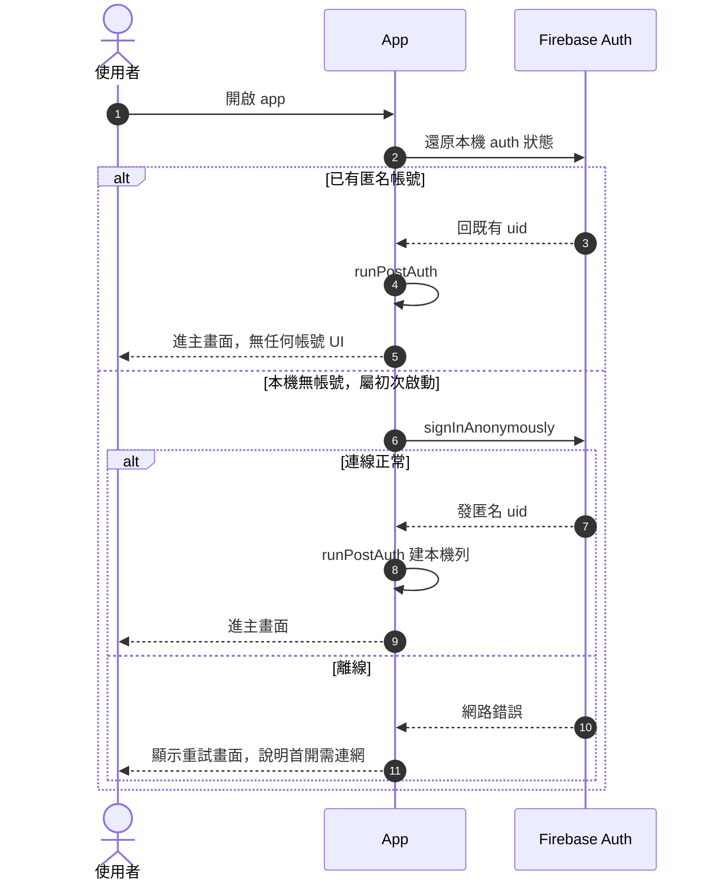
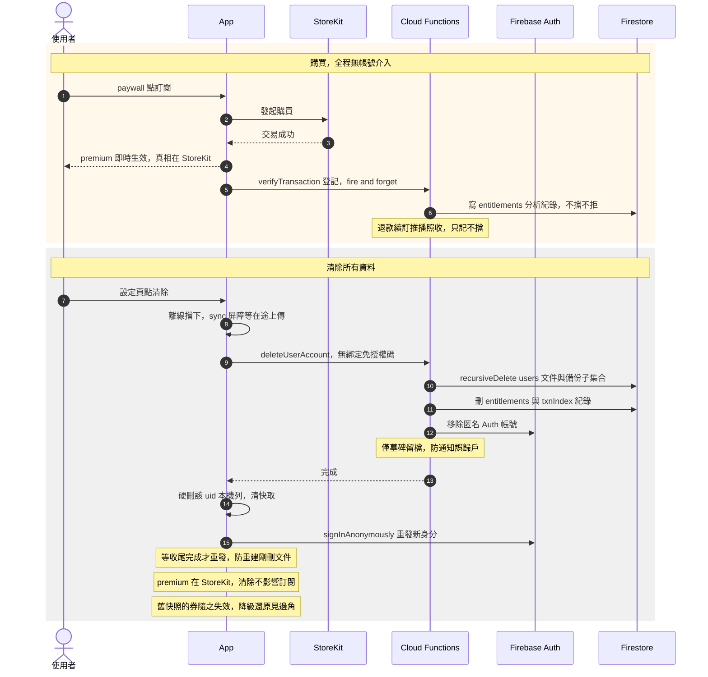
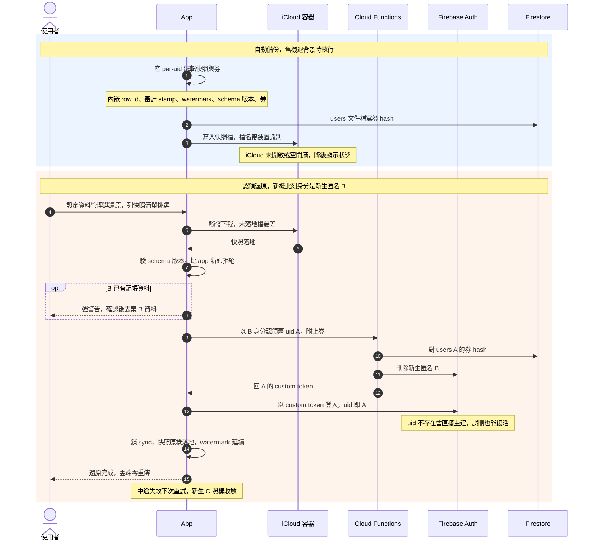

# 無帳號架構與快照身分工作筆記 V3

## 定位與背景

- **來源:**
    - App Store 二輪退件，條款 5.1.1 第 v 款
    - 審核認定強制註冊才能購買訂閱
    - 記帳內容非帳號專屬，註冊必須可選
- **決策方向:**
    - app 無登入功能，無任何帳號 UI
    - 初次啟動自動 `signInAnonymously`，匿名 uid 純內部
    - 訂閱真相在 StoreKit，後端降級為登記
    - 換機還原走 iCloud 快照，快照即身分
    - Firestore 只上傳，永不回流
    - CSV 為跨平台逃生口
- **與雙門筆記的關係:**
    - 出處為註冊登入重設計工作筆記
    - 登入門全數移除，雙門架構不再存在
    - 一門一帳號與同 email 議題隨門消滅
    - 雲端還原懸案收斂，還原走快照認領
    - premium 歸屬懸案收斂，訂閱跟 Apple ID
- **本檔性質:**
    - 工作筆記，非 spec
    - 設計已全數定案，可下傳 spec，路徑見末段

---

## 身分模型

- **唯一身分形態:**
    - Firebase 匿名帳號，領真 uid
    - 使用者不可見，無登入、無登出、無綁定
    - 設定頁無帳號區，只有資料管理
- **身分連續性:**
    - 錨點是快照裡的券，非任何登入門
    - 認領流程以 custom token 接管舊 uid
    - 券躺使用者自己的 iCloud，別人拿不到
- **等級與配額:**
    - 等級由 StoreKit 決定，見訂閱模型
    - 免費配額照舊按 uid 計

---

## 訂閱模型

- **真相來源:**
    - 訂閱真相在 StoreKit，跟 Apple ID 走
    - 客端 gating 看 currentEntitlements，離線有系統快取
    - premium 與 app 身分脫鉤，清除重生照樣有效
    - 退款與到期在 StoreKit 端消失，等級即時回落
- **後端角色:**
    - verifyTransaction 降級為登記，拔綁定拒絕
    - entitlements 集合轉分析用途，餵資料維度
    - 退款續訂推播照收，只記不擋
- **接受的取捨:**
    - 訂閱歸 Apple ID，即 Apple 模型
    - Android 之後套 Play Billing 同款

---

## 儲存模型

- **本機 WatermelonDB:**
    - 唯一操作真相
- **Firestore:**
    - 只上傳鏡像，餵分析與備援
    - 永不回流 client，還原不走這裡
- **iCloud 快照:**
    - 使用者自持備份，唯一還原介質
    - 綁裝置系統登入的 Apple ID，與 app 身分無關
    - 快照兼身分錨點，內含認領用的券
    - 範圍列 1.1，不擋本輪送審
- **CSV 匯出匯入:**
    - 跨平台與跨 app 逃生口，非還原路
    - 匯入造新 id，雲端疊新舊，換機還原禁用

---

## 啟動流程

- 無帳號 UI，啟動只分有帳與無帳
- 熱啟動無事發生，無任何彈窗

---

## 購買與資料清除流程

- 購買與清除兩事件同圖
- 清除是唯一的雲端抹除入口，取代帳號刪除

---

## 快照備份與認領還原流程

- 範圍列 1.1，本輪不實作
- 快照四要素，row id、審計 stamp、watermark、券
- 認領即身分接管，雲端永遠單份

---

## 情境對照表

- 維度為啟動型態、連線狀態、還原型態
- 全程無帳號 UI，無任何彈窗攔路

| 情境 | 結局 |
| --- | --- |
| 初次啟動連線正常 | 匿名身分誕生，直接進 app |
| 初次啟動離線 | 停在重試畫面，連網後續走 |
| 審查員全流程 | 記帳與購買零攔路，無帳號 UI |
| 購買 | premium 即時生效，跟 Apple ID |
| 退款或訂閱到期 | StoreKit 端消失，等級即時回落 |
| 同機重灌 | keychain 多半留存，身分續用 |
| 換新機走整機還原 | keychain 與資料庫隨整機過機，無感續用 |
| 換新機乾淨設定加快照 | 認領舊 uid，零重傳 |
| 新機先記帳後想還原 | 強警告，確認後丟棄新機資料 |
| 清除所有資料後用舊快照 | 券失效，降級還原進現任身分 |
| 無 iCloud 的使用者 | 快照不可用，CSV 兜底 |
| 同人 iPhone 加 Android | 各自身分，訂閱各自商店 |
| 舊機未清繼續並用 | 兩機同 uid 並寫，鏡像交錯可接受 |

---

## 邊角清單

### 啟動時序

- auth 還原以 listener 首回為準，避免搶跑
- 首回為 null 才觸發匿名建立
- 匿名建立單飛防重入，失敗才允許重試
- 建立中殺 app 無害，下次啟動重試
- 伺服端匿名帳號被誤刪，token 刷新報 user-not-found
- 該情境落回無帳號態，重發新 uid
- 有快照者可認領回舊 uid，等同自救
- 防線仍是 console 匿名自動清除保持關閉

### 匿名身分

- provider 回退值現況誤標 google.com，須標 anonymous
- 身分純內部，任何畫面不得曝露 uid
- runPostAuth 沿用，換帳號偵測段移除

### 購買與 premium

- 購買成功即 StoreKit 生效，不等後端與監聽
- verifyTransaction 改 fire and forget，失敗不擋不重試迴圈
- 後端拔綁定拒絕，spec 與 impl 連動 no3_cloud_functions
- premium 判定源改 currentEntitlements，拆 Firestore 監聽
- per-uid premium 離線快取讓位 StoreKit 系統快取，拆除
- restore 鈕語意變同步 StoreKit，永不撞綁定
- 錢路徑重跑 sandbox QA，購買、續訂、退款、restore 四軌

### 資料清除

- 入口文案是清除所有資料，非帳號刪除
- 對話框註明 iCloud 快照保留
- 入口住資料管理頁，與匯入匯出同居
- 偏好頁的刪除帳號列隨登出一併拆除
- 規模為該 uid 全滅，雲端、本機、Auth 本體
- 既有重置資料庫列拔除，功能併入本鈕
- 無任何綁定，永不需要 Apple 授權碼
- 清除後重發新身分，須等本機收尾完成
- 清除中斷復原旗標存在時抑制匿名重發
- 清除不影響訂閱，premium 在 StoreKit
- 清除後舊快照的券失效，認領不再可行
- 清除不碰 iCloud 快照檔，資料仍可降級救回
- 快照檔的刪除只在快照清單，逐檔管理

### 快照與券

- 快照為 per-uid 邏輯匯出，非整庫 sqlite 拷貝
- 券為備份時產的亂數，快照存券，users 文件存 hash
- 認領呼叫以新生匿名身分發出，後端驗券即發 custom token
- 新生匿名帳由後端確認無綁定後自刪
- B 有記帳資料時強警告，確認後丟棄，不做合併
- 警告標明筆數，附先匯出 CSV 的逃生提示
- 認領端點安全基線，SHA-256、App Check、按 uid 限流、連續失敗冷卻
- 細部數值 1.1 實作時定，設計出稿過目一次
- 券長期有效，即還原鑰匙，不輪換
- 券失效時降級還原，資料落現任身分，全量首傳
- 降級還原是唯一造成雲端超集的路，up-only 下可接受
- 快照內嵌 schema 版本，還原比 app 新即拒絕
- 還原全程鎖 sync，仿清除旗標閘門
- 容器檔案可能雲端未下載，要觸發下載與逾時
- iCloud 未開啟或空間滿，功能降級顯示狀態
- 多裝置各自寫檔，檔名帶裝置識別，還原時列清單挑選
- 快照清單兼管理面板，提供逐檔刪除
- RN 無現成 ubiquity 套件，要寫小型 native module
- entitlement 檔加 iCloud Documents container，動 provisioning
- 整機 iCloud 備份本就帶 sqlite 與 keychain 過機，快照補乾淨設定與重灌

### 後台與審查

- console 開 Anonymous provider，發佈前必開
- 匿名自動清除設定必須保持關閉
- 既有 Google 與 Apple provider 留存無妨，無 UI 使用
- Auth enforce 上線時涵蓋匿名與 custom token 流程
- app 無帳號建立，4.8 與帳號刪除義務出局
- 審查資訊註記免登入，demo 帳號退場
- Review Notes 描述無帳號架構，留意字數上限
- 文案變動全量補 20 語言檔

### 既有機制相容確認

- firestore rules 只驗 uid 歸屬，匿名放行
- 備份、偏好上傳、配額全按 uid，零改動
- 墓碑機制沿用，改服務通知誤歸戶防護

---

## 拆除清單

- `LoginScreen` 與登入路由，導航閘門改無條件進主畫面
- Google 與 Apple 登入函式、`GoogleSignin` 設定
- 換帳號偵測與保留清除對話框整組
- 登出功能與其 UI
- 資料管理頁的重置資料庫列，功能併入清除所有資料
- 清除流程裡的 Apple 重新驗證取碼段
- premium 的 Firestore 監聽與 per-uid 離線快取
- 後端 verifyTransaction 的綁定拒絕
- 登入相關 i18n key 全語系清理

---

## 分期範圍

- **本輪 5.1.1 整改:**
    - 拆登入牆與全部帳號 UI，自動匿名進場
    - 訂閱真相切換 StoreKit，後端拔綁定拒絕
    - 資料管理頁整併，一顆清除所有資料
    - 拆除清單全數執行
    - 對應 spec、design、impl、release 素材
- **下一版 1.1:**
    - iCloud 快照與券、認領端點、B 自刪
    - 認領端點安全設計依基線出稿
    - 快照 native module、設定資料管理入口
- **後續輪次:**
    - Android 側 Auto Backup 或 Drive appdata，沿用快照與券格式

---

## 轉正路徑

- **上游反轉:**
    - Product Map 的 Authentication 條目改無帳號架構
    - Product Map 的訂閱條目改 StoreKit 真相
    - Roadmap 登載本輪與 1.1 範圍
- **spec 下傳:**
    - 登入登出 logic 改無帳號 bootstrap，換帳號段移除
    - post auth logic 簡化，provider 取值改 anonymous
    - premium logic 改真相來源 StoreKit，拆監聽與快取
    - no3_cloud_functions spec 拔綁定拒絕，補認領端點於 1.1
    - 刪除帳號 logic 改資料清除語意
    - 快照與認領 logic 新 spec，列 1.1
    - 登入畫面 screen spec 廢止
    - 設定畫面 spec 改資料管理區
- **design 工件:**
    - 設定頁資料管理區、離線重試畫面
    - 登入畫面設計工件廢止
- **console 設定:**
    - Anonymous provider 開啟
    - 匿名自動清除保持關閉
- **branch 慣例:**
    - 涉及各層 git 同名 feat branch，名稱 feat/guest-mode
    - 本輪涉及 no2_accounting_app 與 no3_cloud_functions 兩 module
